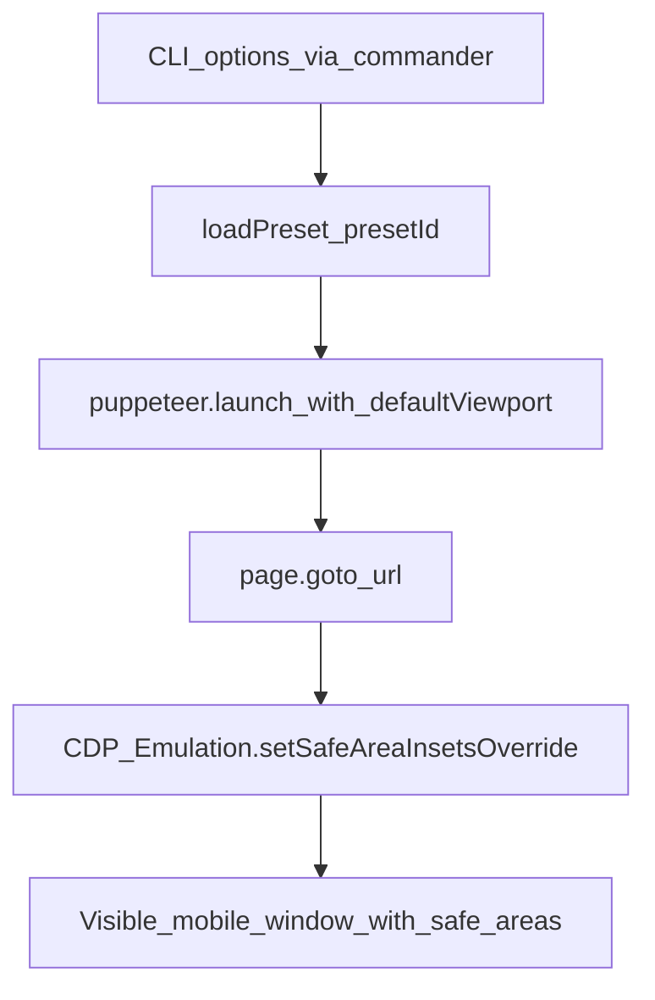

## Safe Area Test

This project is a small Node + Puppeteer helper that launches a Chromium window configured to emulate iOS-style safe area insets. It uses the Chrome DevTools Protocol `Emulation.setSafeAreaInsetsOverride` API so your local web app sees realistic `env(safe-area-inset-*)` values while you visually test layout around the notch and home indicator.

The default setup approximates an iPhone 14 Pro viewport and safe area, letting you quickly verify that headers, tab bars, and other UI elements respect the safe area.

## Prerequisites

- **Node.js**: Any reasonably recent LTS version should work.
- **pnpm**: The project is configured to use `pnpm@10.5.0` as the package manager (see `package.json`).

## Installation

- **Clone the repo** (or copy this folder into your project).
- **Install dependencies** (this will also download a compatible Chromium build the first time, which may take a few minutes):

```bash
pnpm install
```

## Usage

1. **Start your local development server**  
   By default, the script will try to open `http://localhost:3000`, so make sure your app is running there (for example, `pnpm dev`, `npm run dev`, `yarn dev`, etc. in your own app). You can override this with the `--url` flag.

2. **Run the safe area helper (CLI)**

```bash
# Using the package script (via pnpm)
pnpm dev -- --url http://localhost:3000 --preset iphone-14-pro

# Or directly with Node
node main.js --url http://localhost:3000 --preset iphone-14-pro

# List available presets and exit
node main.js --list-presets
```

The `dev` script in `package.json` maps to `node main.js`, so both forms are equivalent. The CLI accepts:

- `--url, -u` (optional): Target URL to open. Defaults to `http://localhost:3000`.
- `--preset, -p` (optional): Device preset ID (for example, `iphone-14-pro`, `pixel-8-pro`). Defaults to `iphone-14-pro`.
- `--list-presets, -l` (optional): Print all available presets and exit.

Running the helper will:

- Launch a **visible** (non-headless) Chromium window.
- Set a mobile-style viewport based on the selected preset (for example, iPhone 14 Pro dimensions).
- Use a raw CDP session to call `Emulation.setSafeAreaInsetsOverride`, overriding the browser's safe area inset environment variables using the preset's safe area inset values.
- Navigate to your target URL and keep the window open until you close it (or stop the Node process).

When everything is working, you should see your app rendered inside a mobile-sized window with the specified safe areas applied.

## Configuration

Most configuration now lives in **preset JSON files** under the `presets` directory next to `main.js`. Each `*.json` file in that folder becomes a device preset that you can reference with `--preset`.

The preset ID is the file name without `.json`. For example:

- `presets/iphone-14-pro.json` → `--preset iphone-14-pro`
- `presets/pixel-8-pro.json` → `--preset pixel-8-pro`

Each preset file should look roughly like this:

```json
{
  "name": "iPhone 14 Pro",
  "viewport": {
    "width": 390,
    "height": 844,
    "isMobile": true,
    "hasTouch": true
  },
  "safeAreaInsets": {
    "top": 47,
    "right": 0,
    "bottom": 34,
    "left": 0
  }
}
```

- **name** (optional): Human-friendly label used when listing presets.
- **viewport** (required): Passed directly as `defaultViewport` to Puppeteer. You can add additional Puppeteer viewport options such as `deviceScaleFactor` or `isLandscape` if desired.
- **safeAreaInsets** (required): Numeric `top`, `right`, `bottom`, and `left` values used by `Emulation.setSafeAreaInsetsOverride`.

To add a new device, copy an existing file, adjust the values, and give it a new file name. The new preset will automatically appear when you run `node main.js --list-presets`.

If you want to change the **default** URL or preset globally, edit the corresponding option defaults in `main.js` (the `--url` and `--preset` options in the Commander setup).

## How it works

At a high level, the flow looks like this:



## Troubleshooting & Notes

- **The page fails to load**
  - The script will log an error like `❌ Failed to load http://localhost:3000.`
  - Most of the time this means your dev server is not running or is not reachable at the `--url` you passed.

- **Unknown or invalid preset**
  - If you pass a preset ID that does not match any `*.json` file in the `presets` directory, the script will print `Unknown preset "<id>"` and, if possible, a list of available presets.
  - Make sure the file exists (for example, `presets/iphone-14-pro.json`) and that it contains valid JSON with `viewport` and `safeAreaInsets` fields.

- **First install is slow**
  - Puppeteer typically downloads its own Chromium binary on first install. This can take a while, especially on slower networks. Subsequent runs should be much faster.

- **Cross-platform behavior**
  - The script itself is cross-platform as long as Node, pnpm, and Puppeteer work on your OS. The examples here assume a typical Node development workflow, but the helper should behave similarly on Windows, macOS, and Linux.

## License

This project is licensed under the **ISC License** as specified in `package.json`.
